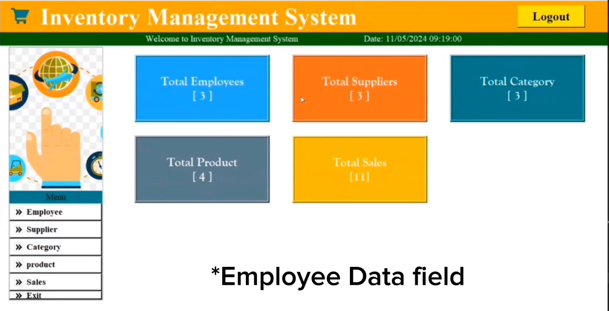

# Inventory-Management-System

Inventory Management System  
An inventory management system is software that helps businesses track and manage their inventory levels, orders, sales, and deliveries. It typically includes features like barcode scanning, stock level tracking, order processing, and reporting.  

**Problem Statement**
The problem statement for an inventory management system typically outlines the challenges a business faces in effectively managing its inventory, such as inefficient tracking methods, overstocking or stockouts, manual errors in order processing, lack of real-time visibility into inventory levels, and difficulties in forecasting demand accurately. It sets the stage for developing a solution that addresses these issues and improves overall inventory management efficiency. If you need help drafting a problem statement or brainstorming solutions, feel free to provide more details about your specific situation.

**Solution**
To address the challenges outlined in the problem statement, a comprehensive solution would involve implementing an inventory management system that offers the following features:

**1. Real-time Inventory Tracking:** Utilize barcode scanning or RFID technology to accurately track inventory movements in real-time, providing visibility into stock levels across multiple locations.

**2. Automated Order Processing:** Streamline the order fulfillment process with automation, from order placement to picking, packing, and shipping, reducing manual errors and processing time.

**3. Supplier Management:** Maintain a centralized database of suppliers, track lead times, costs, and performance metrics to optimize procurement decisions and ensure timely replenishment of inventory.

**4. Reporting and Analytics:** Generate customizable reports and dashboards to provide insights into inventory performance, sales trends, stock turnover rates, and other key metrics, facilitating data-driven decision-making.

**5. Integration with Sales Channels:** Integrate the inventory management system with e-commerce platforms, POS systems, and other sales channels to synchronize inventory levels and automate order processing across all channels.

**Idea**
*"SmartShelf Inventory Management System"*

SmartShelf is an innovative inventory management system designed to revolutionize how businesses track and manage their inventory. The core idea behind SmartShelf is the integration of IoT (Internet of Things) technology with traditional inventory management methods to provide real-time, automated inventory tracking and monitoring.

**Key Features:**

**1. Smart RFID Tags:** Each item in the inventory is equipped with a smart RFID tag containing unique identification information. These tags communicate wirelessly with RFID readers installed on shelves, pallets, or storage bins.
**2. Real-Time Inventory Tracking:** The RFID readers continuously scan the tags as items move in and out of inventory, providing real-time visibility into inventory levels and locations. This ensures accurate and up-to-date inventory data at all times.
**3. SmartShelf Mobile App:** The SmartShelf mobile app allows users to access inventory data from anywhere, at any time. Managers can monitor inventory levels, view replenishment alerts, and track the movement of items using their smartphones or tablets.
**4. Customizable Dashboards and Reports:** SmartShelf provides customizable dashboards and reports that allow users to visualize key inventory metrics such as stock levels, turnover rates, and inventory value. This empowers decision-makers to make informed choices and drive business growth.

**Technology Stack**
The technology stack for an Inventory Management System can vary depending on factors like scalability, functionality, and budget:

**1. Backend**
=> Language: *Python*
=> Framework:-
GUI Development - *Tkinter*

**2. Frontend**
-> *Tkinter*

**3. Testing**
=> Unit testing= *pytest*

**4. Security:**
**>**SSL/TLS for secure communication
**>**Regular security audits and updates to dependencies.

**5. Scalability and Performance:**
**>**Caching: Redis or Memcached
**>**Load balancing
**>**Horizontal scaling strategies
